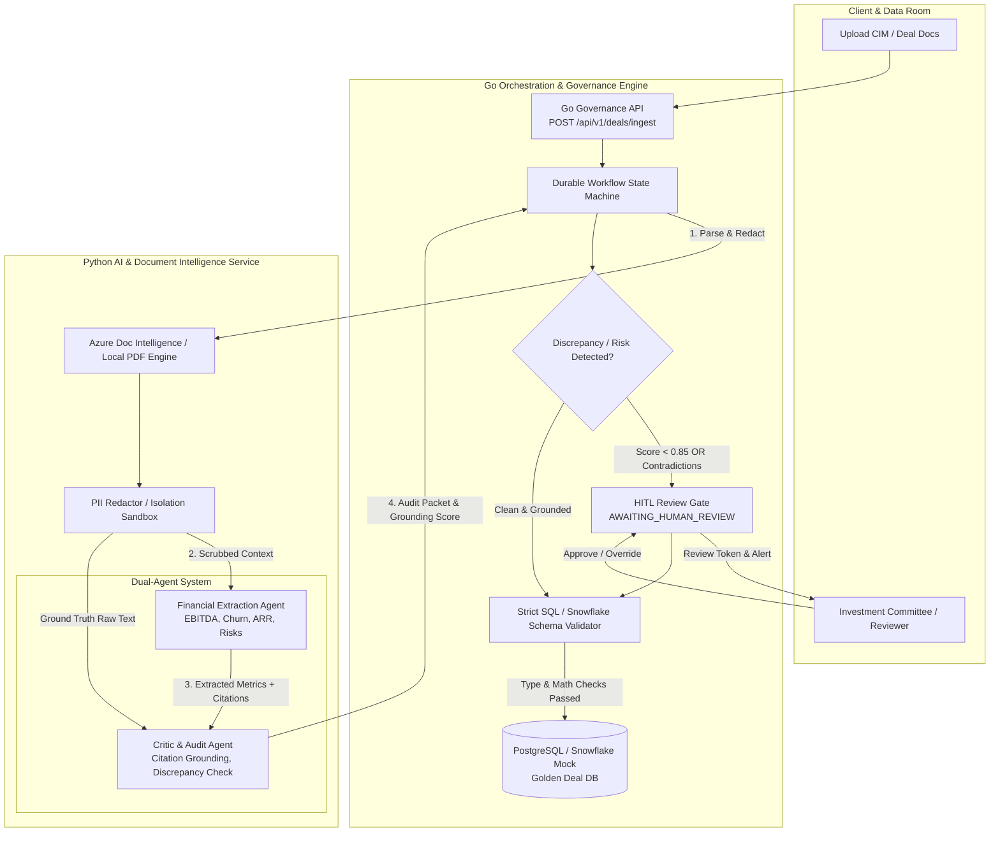

# Agentic VDR Evaluator & Governance Pipeline

[](https://github.com/nk1947-sudo/Agentic-VDR-Evaluator-Governance-Pipeline/actions/workflows/ci.yml)
[](https://golang.org)
[](https://python.org)
[](https://www.docker.com)
[](https://opensource.org/licenses/MIT)

An enterprise-grade, multi-agent evaluation and governance pipeline engineered for **Private Equity Virtual Data Rooms (VDRs)**. The system ingests Confidential Information Memorandums (CIMs), scrubs PII before model exposure, extracts structured financial and risk metrics, validates grounding using an adversarial **Critic Agent**, and halts database writes via a deterministic **Human-in-the-Loop (HITL) circuit breaker** upon detecting hallucinations or multi-page financial discrepancies.

---

## The Private Equity Problem

In private equity deal screening and due diligence:
- Deal teams sift through hundreds of pages of marketing CIMs, CIM appendices, and audited financial statements.
- **The Hallucination Trap**: Standalone LLMs routinely accept marketing presentation claims at face value, missing footnote qualifications or reconciling adjustments.
- **The Defensibility Requirement**: An Investment Committee requires that every extracted red flag and financial figure be strictly audit-defensible, linking directly to exact document citations (page numbers and verbatim quotes).
- **The Governance Imperative**: AI should accelerate first-pass diligence without replacing human judgment. When discrepancies or extreme risk factors occur (e.g., customer concentration > 25%), the pipeline must **deterministically suspend execution** and require cryptographically signed human approval before writing to the golden deal warehouse.

---

## Technical Architecture



---

## Core System Capabilities

### 1. Dual-Agent System (Extraction + Critic)
- **Financial Extraction Agent (GPT-4o)**:
  - Extracts standard financial metrics: Revenue, ARR, Gross Margin, EBITDA, Adjusted EBITDA, Churn (Logo & NRR), Debt, and Cash.
  - Extracts qualitative deal risks: Customer concentration (% of top 1, 5, 10 customers), supplier concentration, regulatory/litigation risks, key-person dependencies.
  - **Citation Mandate**: Every extracted metric must contain `page_number`, `exact_quote`, and `table_reference`.
- **Critic Agent (Auditor / Anti-Hallucination)**:
  - Independent verification pass against the raw scrubbed text.
  - **3-Way Audit**:
    1. **Quote Grounding**: Verifies that the cited quote actually exists on the cited page.
    2. **Mathematical Reconciliation**: Validates internal consistency ($Gross Margin = Gross Profit / Revenue$, $EBITDA \le Revenue$).
    3. **Cross-Document Contradiction Detection**: Scans across sections to catch discrepancies between marketing claims and audited footnotes (e.g., Executive Summary claims $18M EBITDA, but Appendix Footnote 4 audited statement confirms $11.2M EBITDA).
  - Emits an **Audit Packet** with `grounding_score` (0.0 to 1.0), `discrepancies`, and governance recommendation.

### 2. AI Governance, PII Sandboxing & Untrusted Data Isolation
- Scans and masks Personally Identifiable Information (SSNs, personal emails, direct mobile numbers, banking routing numbers) before any document content reaches the LLM.
- Generates a SHA-256 cryptographic hash of the redaction table for compliance auditing without persisting plaintext PII.

### 3. Go Orchestrator & Deterministic HITL Circuit Breaker
- Written in Go 1.23 to enforce zero-leakage workflow guarantees.
- **Deterministic Halt**:
  - If `grounding_score < 0.85` OR `discrepancies.length > 0` OR `customer_concentration > 25.0%`:
    - Transitions deal status to `AWAITING_HUMAN_REVIEW`.
    - Generates a cryptographically signed HMAC-SHA256 `review_token`.
    - Suspends execution; automated writes to the golden database are strictly blocked.
- **Human Review & Override API**:
  - Exposes side-by-side discrepancy reports to the Investment Committee.
  - Allows human reviewers to approve, reject, or override metrics (e.g., overriding management's $18M EBITDA with audited $11.2M) with review token authorization.

### 4. High-Precision Data Validation & Golden Database Persistence
- **Zero Floating-Point Drift**: All currency metrics are stored as `BIGINT` in cents (e.g., $40,000,000.00 = `4000000000`), and percentages are stored as `INTEGER` basis points (e.g., 78.5% = `7850 bps`).
- **PostgreSQL & Snowflake Mock Storage**: Persists records into normalized SQL tables (`deals`, `deal_financials`, `deal_risks`, `audit_logs`) and exports to mock Snowflake data lake staging.

### 5. Adversarial Testing Suite
Includes continuous testing against realistic synthetic Private Equity CIMs in `tests/fixtures/`:
1. `deal_clean_enterprise_saas.pdf`: Clean, fully consistent SaaS CIM -> auto-approved.
2. `deal_adversarial_ebitda_contradiction.pdf`: Contradictory EBITDA claims -> triggers HITL gate.
3. `deal_adversarial_customer_concentration.pdf`: Customer concentration trap (Top Customer = 48.5%) -> triggers HITL gate.
4. `deal_pii_adversarial.pdf`: Tainted with simulated personal PII -> verifies 100% redaction.

---

## Directory Structure

```
Agentic-VDR-Evaluator-Governance-Pipeline/
├── .github/
│   └── workflows/
│       └── ci.yml                     # Multi-stage CI testing: Go test, Python pytest, Adversarial Suite
├── docker-compose.yml                 # PostgreSQL, AI Engine (FastAPI), Orchestrator (Go)
├── Makefile                           # Unified build, test, seed, and run targets
├── scripts/
│   ├── init.sql                       # PostgreSQL schema & audit ledger DDL
│   └── seed_mock_data.py              # Generates synthetic PDF CIM test documents
├── services/
│   ├── ai-engine/                     # Python 3.13 FastAPI AI Service
│   │   ├── Dockerfile
│   │   ├── requirements.txt
│   │   ├── main.py                    # Ingestion, PII scrubbing, extraction & critic API
│   │   ├── config.py
│   │   ├── ingestion/
│   │   │   ├── pii_scrubber.py        # PII redactor & token mask generator
│   │   │   ├── ocr_azure.py           # Azure Document Intelligence client
│   │   │   └── pdf_fallback.py        # Local PDF layout & table parser
│   │   ├── agents/
│   │   │   ├── prompts.py             # PE extraction & adversarial critic prompts
│   │   │   ├── extractor_agent.py     # Metric extraction with citations
│   │   │   └── critic_agent.py        # Citation grounding & contradiction detector
│   │   ├── models/
│   │   │   ├── deal_metrics.py        # Structured Pydantic schemas
│   │   │   └── schemas.py
│   │   └── tests/                     # AI Engine unit tests
│   └── orchestrator/                  # Go 1.23 Governance & Workflow Engine
│       ├── Dockerfile
│       ├── go.mod
│       ├── main.go                    # Go HTTP server entrypoint
│       ├── config/
│       ├── models/                    # Go domain structs
│       ├── statemachine/
│       │   ├── machine.go             # Workflow state transitions
│       │   ├── token.go               # HMAC-SHA256 review token generator
│       │   └── evaluator.go           # HITL governance rules engine
│       ├── validator/
│       │   ├── schema_validator.go    # Precision cents & basis points validator
│       │   └── math_reconciler.go     # Accounting sanity checks
│       ├── storage/
│       │   ├── postgres.go            # PostgreSQL storage & in-memory fallback
│       │   └── mock_snowflake.go      # Snowflake staging exporter
│       ├── api/                       # Ingestion & Review REST handlers
│       └── tests/                     # State machine & validator unit tests
└── tests/
    └── adversarial/
        ├── test_adversarial_pipeline.py # End-to-end adversarial evaluation suite
        └── fixtures/                  # Multi-page synthetic CIM PDFs
```

---

## Getting Started

### Prerequisites
- Python 3.13+
- Go 1.23+
- Docker & Docker Compose (optional for containerized deployment)

### 1. Local Setup
```bash
# Clone the repository
git clone https://github.com/nk1947-sudo/Agentic-VDR-Evaluator-Governance-Pipeline.git
cd Agentic-VDR-Evaluator-Governance-Pipeline

# Install Python dependencies
pip install -r services/ai-engine/requirements.txt

# Install Go dependencies
cd services/orchestrator && go mod tidy && cd ../..
```

### 2. Generate Synthetic Test CIMs
```bash
python scripts/seed_mock_data.py
```

### 3. Run Test Suites
```bash
# Run Python AI Engine unit tests
pytest services/ai-engine/tests -v

# Run Go Orchestrator & Governance unit tests
cd services/orchestrator && go test -v ./... && cd ../..

# Run End-to-End Adversarial Evaluation Suite
pytest tests/adversarial -v -s
```

---

## Docker Compose Deployment

Launch the complete stack (PostgreSQL, Python AI Engine, and Go Orchestrator) with one command:

```bash
docker compose up --build -d
```

Check service health:
- Go Orchestrator: `http://localhost:8080/api/v1/health`
- Python AI Engine: `http://localhost:8000/api/v1/health`

---

## API Endpoints

### 1. Ingest VDR Document
```http
POST /api/v1/deals/ingest
Content-Type: multipart/form-data

document: <file.pdf>
company_name: "Apex Logistics Software"
target_industry: "Supply Chain"
```

**Clean Document Response (200 OK):**
```json
{
  "message": "Deal evaluated, verified, and committed to golden database successfully.",
  "deal_id": "75c3298a-5cbf-4375-8025-a45e69e46a77",
  "status": "COMMITTED",
  "grounding_score": 0.95,
  "committed_records": 1,
  "snowflake_staged_path": "./data/snowflake_staging/stage_deal_75c3298a.json"
}
```

**Contradictory / High-Risk Document Response (202 Accepted - Circuit Breaker Engaged):**
```json
{
  "message": "Human-In-The-Loop review required. Automated database write blocked.",
  "reasons": [
    "Critic flagged EBITDA Contradiction [CRITICAL]: Severe financial discrepancy: Marketing summary claims EBITDA of $18,000,000 (Page 1), but audited notes on Page 4 report $11,200,000."
  ],
  "review_packet": {
    "deal_id": "8f391b12-9c10-4131-b75b-9d481bb20921",
    "status": "AWAITING_HUMAN_REVIEW",
    "review_token": "8f391b12-9c10-4131-b75b-9d481bb20921:1757342400:a1b2c3d4...",
    "requires_human_review": true
  },
  "approval_endpoint": "/api/v1/deals/8f391b12-9c10-4131-b75b-9d481bb20921/decision"
}
```

### 2. Inspect Review Packet
```http
GET /api/v1/deals/{deal_id}/review
```

### 3. Human Approval / Override Decision
```http
POST /api/v1/deals/{deal_id}/decision
Content-Type: application/json

{
  "action": "OVERRIDE",
  "reviewer_name": "Investment Committee Partner John",
  "review_token": "8f391b12-9c10-4131-b75b-9d481bb20921:1757342400:a1b2c3d4...",
  "comment": "Overriding marketing EBITDA ($18M) with Note 4 audited GAAP EBITDA ($11.2M).",
  "override_ebitda_cents": 1120000000
}
```

---

## Security & Governance Guardrails

1. **Untrusted Data Isolation**: Raw documents are processed in sandboxed parsers with PII scrubbing before reaching LLM context windows.
2. **Cryptographic Review Tokens**: Review decisions cannot be forged. Each review packet includes an HMAC-SHA256 signed token binding the deal ID and expiration.
3. **Immutable Audit Ledger**: Every decision (automated fast-track or human override) is permanently recorded in `audit_logs` with timestamps, grounding scores, reviewer identities, and rationale.

---

## License

This project is licensed under the MIT License - see the [LICENSE](LICENSE) file for details.
